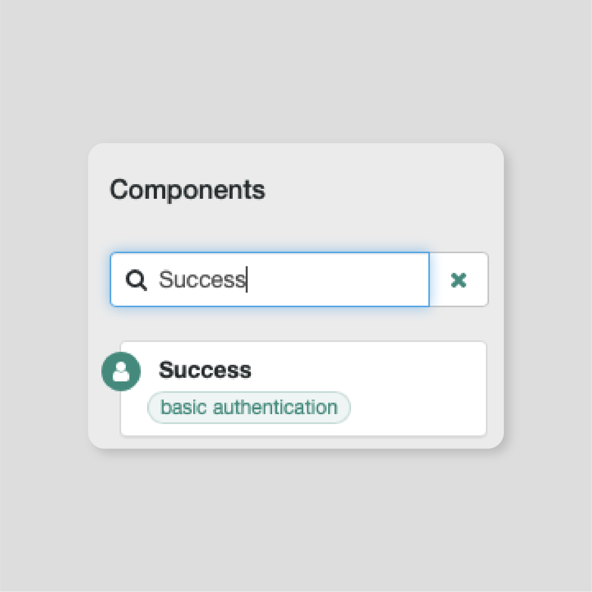

](Images/ZenKey_rgb.png)

## ZenKey Identity Service Overview
ZenKey Identity Service is a unique, network-based identity solution that relies on data derived from wireless carriers to verify users. It provides a highly secure way for online services to verify their customers’ identities when they login from mobile devices and, lets people easily log into websites. This solution helps eliminate the need to remember, manage or update dozens of usernames and passwords that customers use today to log into web sites.

The ZenKey Identity Service integration with ForgeRock supports primary device flows, and secondary device flows using a browser on a laptop, desktop, or mobile device. For more information about these authentication flows, see the Server and Web Integration Guide.

For information about how to integrate ZenKey into iOS and Android applications, visit the ZenKey Developer Resource Site.

## Prerequisites for integrating ZenKey and ForgeRock
* You must have an instance of ForgeRock Access Management 6.5.0 or greater installed and running.
* You must be registered in the ZenKey Developer Portal. Once your company is approved, make note of your client id and client secret. For more information, see the ZenKey Portal User Guide.
* The wireless carriers must provision your client. Currently, the provisioning step may take a few days, but will be faster in the future.

## Install the ZenKey Authentication Node
1. In a browser, go to https://github.com/ForgeRock/ZenKey-Auth-Tree-Node/releases.
2. Download the latest ZenKeyNode .jar file.
3. Install the .jar file on the web server that is hosting Access Management. On Tomcat, put the jar file in the lib directory. For example: ```/tomcat/webapps/openam/WEB-INF/lib```
4. Restart the server.

## Configure the ZenKey Authentication Node
1. In a browser, login to ForgeRock Access Management with your amadmin credentials
https://<am_url.com>/openam/console

2. On the **Realms** page, click **Top Level Realm**.


3. On the **Realm Overview** page, click **Authentication > Trees**.


4. Click **Create Tree**.


5. In the **Tree Name** field, enter a name for the node.

6. Click **Create**.


7. In the left side panel under **Components**, type ``ZenKey`` in the filter field.


8. When the **ZenKey Auth** Node appears in the left side panel, select the node and drag it to the main body of the page.

9. Connect the **Start** node to **ZenKey Auth Node** by dragging the green dot on the **Start** node to **ZenKey Auth Node**.


10. In the left side panel under **Components**, type ``Create Object`` in the filter field.


11. When the **Create Object** node appears in the left side panel, select the node and drag it to the main body of the page.

12. Connect the *No Account exists* dot on the **ZenKey Auth Node** to the left side dot on the **Create Object** node.


The **Create Object** node must output to some node for both the *Created* and the *Failed* options.

13. Create and attach placeholder nodes for the output of the **Create Object** node. In the left side panel under **Components**, type ``Message`` in the filter field. Select and drag the resulting **Message** node onto the main body of the page, and connect the **Create Object** node's *Created* dot to the left side dot of the **Message** node.

14. Repeat the previous step to connect the **Create Object** node's *Failed* dot to another **Message** node.


15. In the left side panel under **Components**, type ``Success`` in the filter field.


16. When the **Success** node appears in the left side panel, select the node and drag it to the main body of the page.

17. Connect the *True* dot on the **Message** node associated with the **Create Object** node's *Created* dot to the left side dot on the **Success** node. Do the same with the **Create Object** node's *Failed* dot.


18. In the left side panel under **Components**, type ``Failure`` in the filter field.


19. When the **Failure** node appears in the left side panel, select the node and drag it to the main body of the page.

20. Connect the *True* dot on the **Message** node associated with the **Create Object** node's *Failed* dot to the left side dot on the **Failure** node. Do the same with the **Create Object** node's *False* dot.

The final product should look like this:


21. Click **Save**.


## Add Developer Portal credentials to the ZenKey Auth Node
1. Select the **ZenKey Auth Node**.
2. On the right side of the page, scroll down until you see the **Client ID** field.
3. Enter your client ID and client secret from the ZenKey Developer Portal dashboard into the **Client ID** and the **Client Secret** fields, respectively. The page then auto-populates the Carrier Discovery URL, OIDC Provider Config URL, and the Redirect URL fields. You configure the Redirect URL in the Developer Portal.
4. Add scopes for app and site users. On the right side of the page, in the **OAuth** field, enter one or more of the following scopes:
	* *openid*
	* *profile name*
	* *email*
	* *phone*
5. Click **Save**.

## Configure Account and Attribute mappings
1. Select the **ZenKey Auth Node**.
2. On the right side of the page, scroll down to the **Account Mapper Configuration** section.
3. Verify the value in the **KEY** field is `email`.
4. Verify the value in the **VALUE** field is `uid`.
5. Scroll down to the **Attribute Mapper Configuration** section.
6. Verify the value in the **KEY** field is `email`.
7. Verify the value in the **VALUE** field is `uid`.
8. Click **Save**.

## Set the Default Authentication Service to ZenKey
Set ZenKey as the authentication service for all websites that connect to the Access Management server.

1. Click **Top Level Realm**.
2. On the **Realms** page, navigate to **Realm Overview > Authentication > Settings**.
In the **Organization Authentication Configuration** drop down field, select ``ZenKey``.
3. Click **Save Changes**.
4. Logout.

## Test the ZenKey ForgeRock Configuration
You should verify that you correctly integrated ZenKey with your ForgeRock instance.

1. Log out of the Access Management instance.

2. Access the Access Management instance again by visiting https://<am_url>.com/openam/console.

3. Log in with ZenKey by clicking the green micro button.


3. Select your ZenKey account.

Note: If you are not using a trusted browser, follow the on-screen prompts to connect your browser to ZenKey.

The authorization request is sent to your ZenKey app.


4. Open the ZenKey app on your phone and press **Continue**.


You have successfully logged in within your browser.
